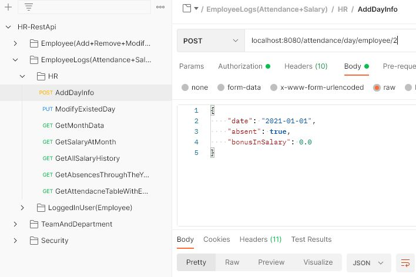

# HR-System-Using-RestAPI

this project is an HR system where the of it is managing employees teams, departments, salaries...and so on. System is able to apply CRUD operation on the DB

#### The project will be fully driven by [JavaSpringBoot](https://www.tutorialspoint.com/spring_boot/spring_boot_introduction.htm) ​Framework, and MySql Database


## Add new employee using postman
New employee data is transferred through an HTTP request body carrying employee data as a json. This request gets sent to a servlet that calls the addEmployee api.
json date from request body gets mapped to a java object that gets stored in the SQL database. Using JPA and hibernate that are built in springboot

- **this request can be done by employees with HR role only**
- no id has to be sent. employee id is autogenerated
- when adding a manager to employee. Manager id has to sent as an object and same thing for team and department

  ```
  "manager":{"id":1},
  "team":{"id":1}
  "department":{"id":1}
  ```


## modify employee using postman
- **this request can be done by employees with HR role only**
- employee id has to be added after the uri


## get employee from authentication using postman
- **this request can be done by employees with HR or EMPLOYEE role**
- this request gets employee data from authentication username


## add new day details using postman
- **this request can be done by employees with HR role only**
- employee id has to be added after the uri
- this request adds new dat data to a month
- this day can either carry absence in current day or bonus in salary
- **important ->** to creat a new month for an employee a day has to be added and this month date


## change password using postman
- **this request can be done by employees with HR or EMPLOYEE role**
- old password (currentPassword) has to be correct inorder to change old password with the new one


## ~~Current TodoList~~
- [x] add command + api to modify employee salary
- [x] working on attendance apis
- [x] Test for addNewDayData doesn't work
- [x] Basic Authorization with every request
- [x] Add test cases for all attendance table apis
- [x] Rest Api to get absences through the year till specific month
- [x] Rest Api to add day with details: [absence, bonusInSalary] + dayDate
- [x] Rest Api to get employee salary with calculating deduction[**through the year**] and bonuses[**monthly**]
- [x] Api to check deduction at specific month [checking absences through year till specific month]
- [x] Rest Api to show salary history In a month

## ~~Improving Code _Todo List_~~

- [x] Auto generate getters and setters using -> **_(Project Lombok)_**
- [x] Handle Exceptions at client side
- [x] Use Enums to replace constants
- [x] Migration of MySQl DB using **_flyway_**
- [x] Improve Testing using **_DBunit_**
- [x] mapping data from DTO to main entities delete all boilerplate code.
- [x] **Remove the beautiful magic numbers ✨**


## ~~ToDo List~~ 

- [x] Add Team to Employee
- [x] Deal with Employee salary logic
- [x] Rest API to add Employee
- [x] Rest API to get employee Info
- [x] Rest API to modify employee
- [x] Rest API to delete employee
- [x] Dealing with manager deletion logic
- [x] Rest API to get Employee salary info
- [x] Rest API to get All employees under a specific manager
- [x] Rest API to get All employees under a specific manager ***>> recursively <<***
- [x] Rest Api to get All Employees in some team
- [x] Primary key sequence for each table

## Currently working on
- #### improving code stability and adding comments
